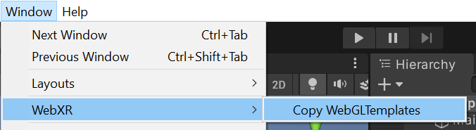
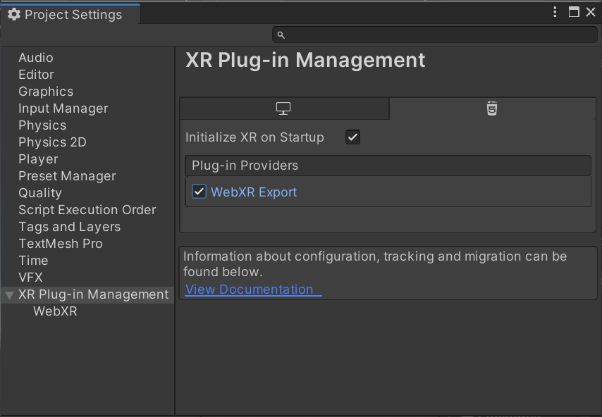
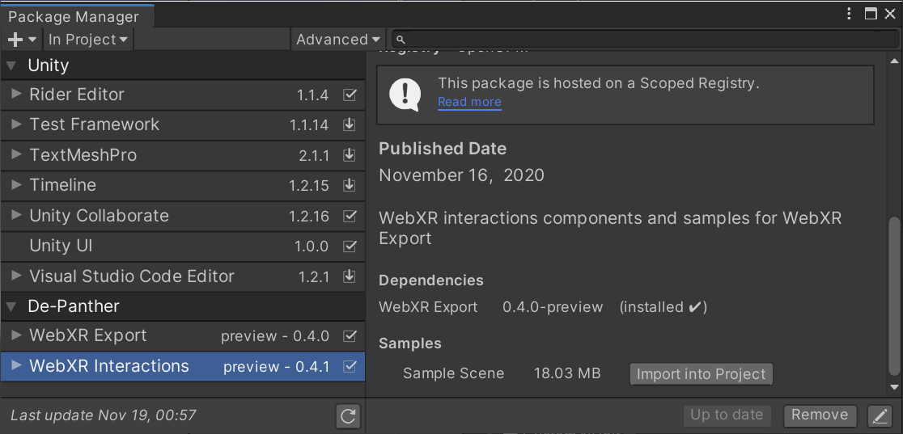
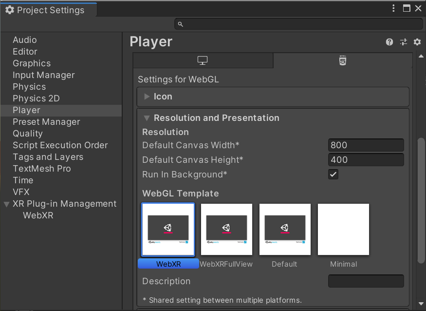
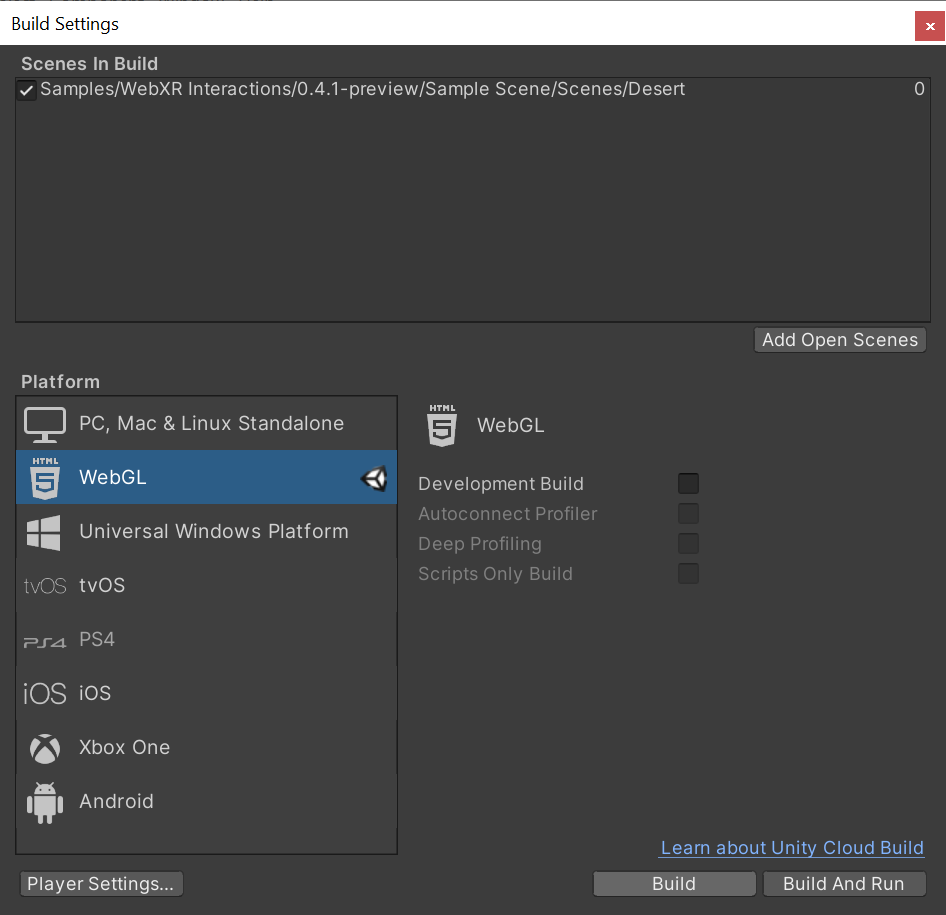
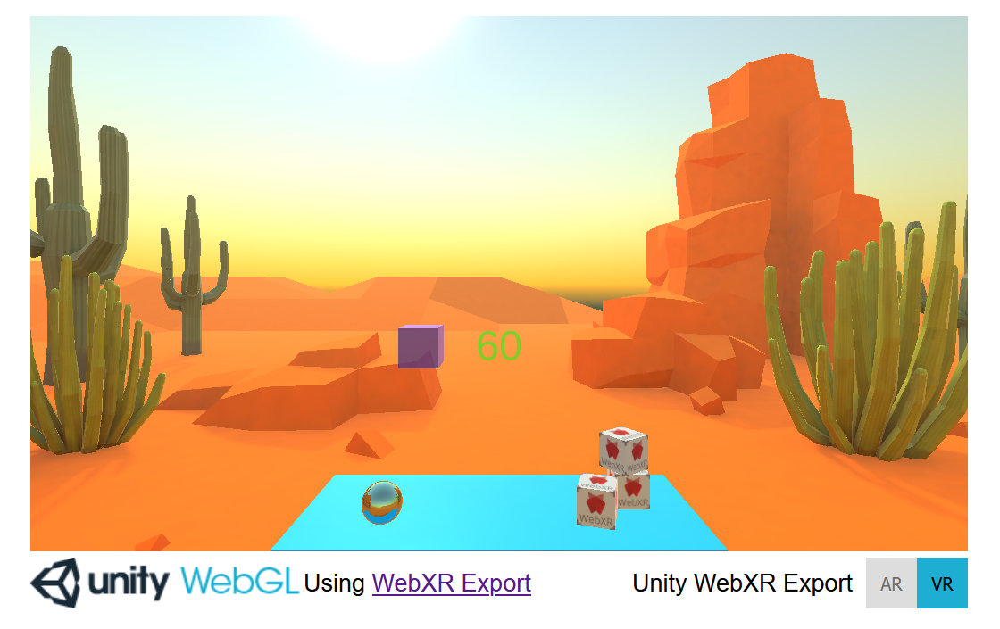

# Unity WebXR Demo

Develop WebXR experiences using Unity Engine and WebXR Export.

[WebXR Export](https://github.com/De-Panther/unity-webxr-export/) supports both Augmented Reality and Virtual Reality [WebXR API](https://www.w3.org/TR/webxr/) immersive sessions.

## Create new project

Create a new Unity Project (2019.4.7f1 and up). Switch platform to WebGL.

Import WebXR Export and WebXR Interactions packages from OpenUPM.
- [WebXR Export ](https://openupm.com/packages/com.de-panther.webxr/)
- [WebXR Interactions ](https://openupm.com/packages/com.de-panther.webxr-interactions/)

Once packages are imported, Go to `Window > WebXR > Copy WebGLTemplates`.

After `WebGLTemplates` are in the `Assets` folder, Open the `XR Plug-in Management` tab in the `Project Settings` window and select the `WebXR Export` plug-in provider.

Now you can import the `Sample Scene` from `Window > Package Manager > WebXR Interactions > Sample Scene > Import into Project`.

In `Project Settings > Player > Resolution and Presentation`, select `WebXR` as the `WebGL Template`. (If you are using Unity 2020.x and up you should use the 2020 templates)

Now you can build the project.

WebXR requires a secure context (HTTPS server or localhost URL). Make sure to build the project from `Build Settings > Build`. Unity's `Build And Run` server use HTTP. Run the build on your own HTTPS server.

## 💾 Downloads

Better option: Import WebXR Export and WebXR Interactions packages from OpenUPM.
- [WebXR Export ](https://openupm.com/packages/com.de-panther.webxr/)
- [WebXR Interactions ](https://openupm.com/packages/com.de-panther.webxr-interactions/)

### 📝 Unity Editor version

* `2019.4.33` and up.
* `2020.1` and up.
* `2021.1` and up.

### 🗺️ Browser Compatibility

This is a list of browsers and platforms that the WebXR Export demo was tested on.

- Google Chrome, Microsoft Edge, Mozilla Firefox on Windows.
- Oculus Browser on Oculus Quest (Supports WebXR Hand Input).
- Google Chrome on Android (Supports both AR and VR sessions).

### ⚙️ WebXR APIs support

[WebXR Device API](https://immersive-web.github.io/webxr/)

[WebXR Gamepads Module](https://immersive-web.github.io/webxr-gamepads-module/) (Including [hapticActuators](https://w3c.github.io/gamepad/extensions.html) on supported devices)

[WebXR Augmented Reality Module](https://immersive-web.github.io/webxr-ar-module/)

[WebXR Hit Test Module](https://immersive-web.github.io/hit-test/) (Currently limited to viewer space Hit Test source)

[WebXR Hand Input](https://github.com/immersive-web/webxr-hand-input)

[WebXR Input Profiles](https://github.com/immersive-web/webxr-input-profiles) using [WebXR Input Profiles Loader](https://github.com/De-Panther/webxr-input-profiles-loader)

## 📄 Documentation

For more info on getting started and how to use WebXR Export, you can check the [Documentation](Documentation) folder.

## 🔗 Useful links and info

Much of the WebXR upgrades and API usage made possible thanks to these resources.

- [WebVR to WebXR Migration Guide](https://github.com/immersive-web/webxr/blob/master/webvr-migration.md)
- [WebXR Device API Explained](https://github.com/immersive-web/webxr/blob/master/explainer.md)
- [WebXR Input Profile Viewer](https://immersive-web.github.io/webxr-input-profiles/packages/viewer/dist/index.html)
- [WebXR Samples](https://immersive-web.github.io/webxr-samples/)
- [WebXR Polyfill](https://github.com/immersive-web/webxr-polyfill)
- [The Immersive Web Working Group/Community Group](https://immersive-web.github.io/)

## Video tutorials

- [WebXR Export for Unity - 2020-11-01 Update](https://www.youtube.com/watch?v=tASwwuMPtF8) by De-Panther
- [WebXR Export for Unity - Controllers update in v0.4.0](https://www.youtube.com/watch?v=N9iACzNCnos) by De-Panther
- [BUG 1/27/2021 WebXR for Game Jams](https://www.youtube.com/watch?v=2Qnii0SlAtM) De-Panther at Boston Unity Group
- [How To Setup WebXR with Oculus Quest](https://www.youtube.com/watch?v=nPAHZ9Rm8d4) by FusedVR
- [How To Use VRTK & Tillia with WebXR Export](https://www.youtube.com/watch?v=RKpa2tDvNiQ) by FusedVR

